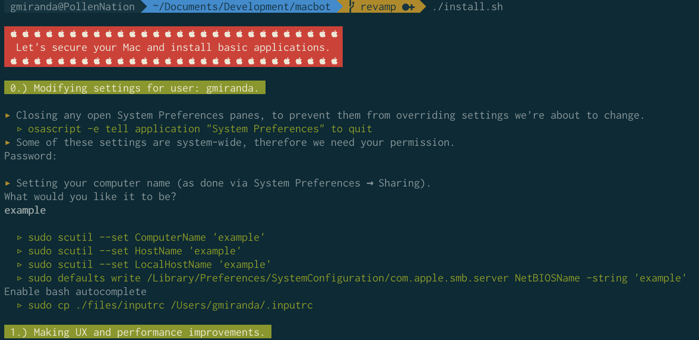

# Macbot

Macbot is a shell script to automatically configure your Mac with sane and secure settings. It's free to use, Apache 2.0 licensed.

# Usage

1. Review all the code in this repository. The code in here is kept simple and readable on purpose. It's just shell scripts.

2. Modify the `install.sh`. You'll probably want to tweak some of the performance settings, and install different applications.

3. Run install.sh using Terminal.app. `sh ./install.sh`

4. Automating everything is not always feasible, so fill out your own backup.md and install.md to document any extra manual steps, so you don't forget.

# Blog Post

This repo is based on [echohack's macbot](https://github.com/echohack/macbot). I've updated it for Catalina, my own preferences, and refactored a bit. See that repo for more background and details.
